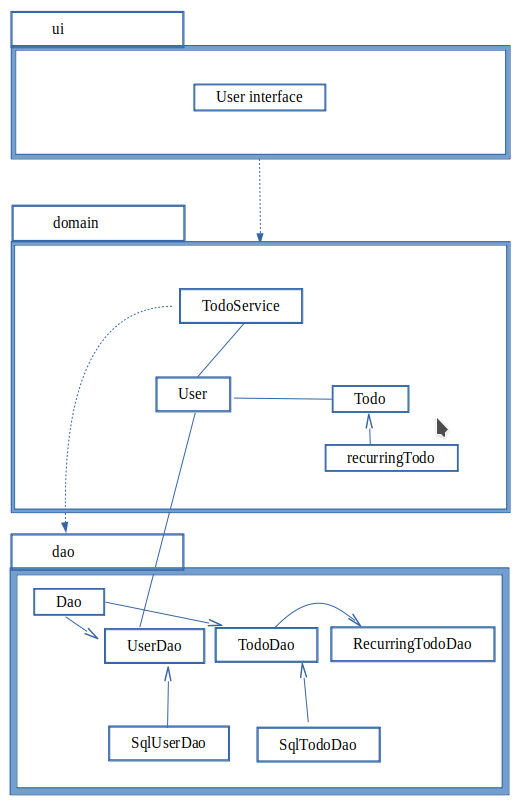

# Arkkitehtuurikuvaus

Sovelluksessa on kolme luokkaa: käyttöliittymä, sovelluslogiikka ja tarvittavat luokkaoliot sekä rajapinnat luokkaolioiden käsittelyyn sekä tiedon tallentamiseen.

## Rakenne

Ohjelma on tehty kerrosarkkitehtuurin periaatteita noudattaen ja näyttää tältä:

## Käyttöliittymä

Käyttöliittymän ensimmäinen näkymä on sisäänkirjautumissivu, josta pääsee myös luomaan uuden käyttäjän.

Päänäkymä on avoimet tehtävät, jossa näkyy tehtävät avoimet tehtätävät sekä samana päivänä suoritetut. Tällä näkymällä myös lisätään uusia tehtäviä käyttäjälle.

Kolmas näkymä on arkistonäkymä, jossa on aiemmin tehdyt tehtävät.

## Sovelluslogiikka 

TodoService hallinnoin kuka on kirjautunut sisään ja etsii käyttäjän tehtävät. Sovelluslogiikka jaottelee ne tehtyihin ja avoimiin tehtäviin. Lisäksi sovelluslogiikka on vastuussa uusien tehtävien lisäämisestä listaan ja käyttäjän tekemistä muutoksista niihin. Vielä varsinainen tallennus on tekemättä, mutta se on tarkoitus lisätä sqlite-tietokantaa hyödyntäen viimeisellä viikolla.