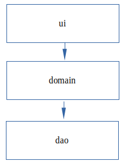
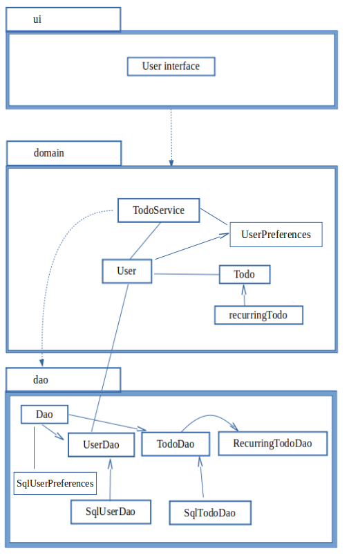
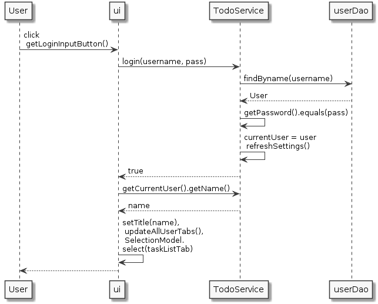
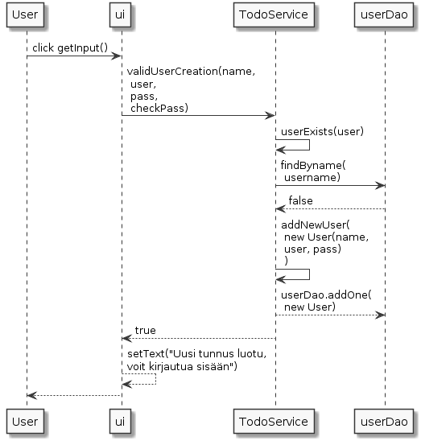
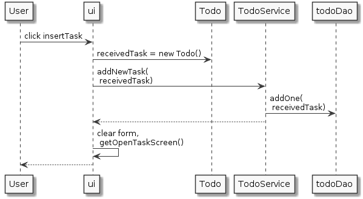

# Arkkitehtuurikuvaus

Sovelluksessa on kolme luokkaa: käyttöliittymä, sovelluslogiikka ja tarvittavat luokkaoliot sekä rajapinnat luokkaolioiden käsittelyyn sekä tiedon tallentamiseen.

## Rakenne

Ohjelma on tehty kerrosarkkitehtuurin periaatteita noudattaen ja näyttää tältä:



## Käyttöliittymä

Käyttöliittymän ensimmäinen näkymä on sisäänkirjautumissivu, josta pääsee myös luomaan uuden käyttäjän (oma näkymänsä). Tällä välilehdellä näytetään myös uloskirjautumissivu käyttäjälle, joka on kirjautunut sisään (kuudes näkymä).

Päänäkymä on avoimet tehtävät, jossa näkyy tehtävät avoimet tehtätävät sekä samana päivänä suoritetut. Tällä näkymällä myös lisätään uusia tehtäviä käyttäjälle.

Kolmas näkymä on arkistonäkymä, jossa on aiemmin tehdyt tehtävät.

Neljäs näkymä on asetukset -näkymä, jossa sisäänkirjautunut käyttäjä hallinnoi henkilökohtaisia asetuksiaan.


## Sovelluslogiikka 

TodoService hallinnoin kuka on kirjautunut sisään ja etsii käyttäjän tehtävät sekä oletusasetukset. Sovelluslogiikka jaottelee ne tehtyihin ja avoimiin tehtäviin. Lisäksi sovelluslogiikka on vastuussa uusien tehtävien lisäämisestä listaan ja käyttäjän tekemistä muutoksista niihin. Tallennus tapahtuu sqlite-tietokantaa hyödyntäen paikalliseen tietokantaan.




## Päätoiminnallisuudet

### sisäänkirjautuminen

Käyttäjän sisäänkirjaantuminen sekvenssikaaviona


Nappia painamalla etusivun käyttöliittymä ottaa vastaan käyttäjänimen ja salasanan, jonka TodoService ottaa vastaan. Käyttäjänimellä etsitään aiemmin luotuja käyttäjiä tietokannasta. Käyttäjän löytyessä userDao palauttaa käyttäjän todoServicelle, joka tarkistaa että annettu ja kannasta löytynyt salasanat täsmäävät. Sen jälkeen logiikkaan tallennetaan kirjautuva käyttäjä currentUseriksi ja päivitetään hänen oletusasetuksensa logiikan käyttöön. Logiikka palauttaa truen käyttöliittymälle, joka päivittää kaikki näkymät sisäänkirjautuneen tehtävillä ja siirtää näkymän avoimien tehtävien tabille.

### uuden käyttäjän luominen



Käyttäjä täyttää tiedot uuden käyttäjän lomakkeella, jossa nappia painaessaan käyttöliittymä kutsuu sovelluslogiikkaan validUserCreation-metodilla. Logiikka kutsuu sisäistä metodiaan tarkistamaan onko käyttäjänimi jo olemassa ja kutsuu seuraavaksi userDaota. Kun kaikki menee hyvin dao palauttaa falsen logiikalle, minkä jälkeen uusi User-olio luodaan ja lisätään tietokantaa. Lopuksi sovelluslogiikka palauttaa true-totuusarvon käyttöliittymälle, joka päivittää lomakkeen alle tiedon onnistuneesta käyttäjätunnuksen luomisesta. Kontrolli palautuu käyttäjälle. 

### uuden tehtävän luominen 


Uusi tehtävä luodaan täyttämällä vähimmäistiedot tehtävästä (kuten nimi ja onko toistuva vai ei). Käyttöliittymä tarkistaa syötteet ja luo uuden tehtävä-olion tietojen perusteella, minkä jälkeen kutsuu logiikan addNewTask-metodia uudella tehtävällä. Sovelluslogiikka kutsuu todoDaon addOne-metodia, joka tallentaa tehtävän tietokantaan. Tämän jälkeen käyttöliittymä päivittää tehtävänäkymänsä, tyhjentää tehtävän lisäys-lomakkeen ja palauttaa kontrollin käyttäjälle.

### Muut 

Muut metodit toimivat samaan tapaan. Käyttöliittymä tarkastaa syötteet ja kutsuu uusin tiedoin sovelluslogiikkaa, joka kutsuu dao-tietokanta-luokkia pysyväistallennuksen operaatioita varten.

## Pysyväistallennus

Pakkauksen dao luokat SqlTodoDao, SqlUserDao ja SqlUserPreferences. Toiminnan pohjalla on Data Access Object (DAO) -suunnittelumalli, joka on esitelty Helsingin yliopiston tietokantojen perusteet -kurssilla sekä Ohjelmointiprojektin referenssiprojektin toteutuksessa. DAO käyttää hyväkseen rajapintoja jokaiselle luokkaoliolle eli tehtäville (Todo), toistuville tehtäville (RecurringTodo), käyttäjille (User) sekä käyttäjäkohtaisille oletusasetuksille (UserPreferences).

### Tietokannat

Sovellus tallentaa käyttämänsä tiedot tasks.db -nimiseen sqlite-tietokantaan käyttäjän kovalevylle. 

#### käyttäjätaulu

```sql
Users (
id integer PRIMARY KEY,
name text NOT NULL,
username text NOT NULL UNIQUE, 
password text NOT NULL
);
```

#### tehtävä-taulu
```sql
Tasks (
    id integer PRIMARY KEY,
    task text NOT NULL,
    dueDate text NOT NULL,
    startDate text,
    doneDate text,
    completed boolean NOT NULL,
    user integer NOT NULL,
    recurringInterval integer,
    FOREIGN KEY (user) REFERENCES Users(id)
);
```

#### käyttäjien asetukset
```sql
Preferences (
    id integer PRIMARY KEY,
    dueDays integer NOT NULL,
    recurringInterval integer NOT NULL,
    user integer NOT NULL,
    FOREIGN KEY (user) REFERENCES Users(id)
);
```

## Kehitettävät osiot ohjelmassa

### käyttöliittymä
Käyttöliittymä oli varsin hankala rakentaa ja projektin edetessä vasta kuulin FXML-tavasta rakentaa käyttöliittymiä, joten se voisi olla hyvä tapa selkeyttää nyt varsin pitkää käyttöliittymäluokkaa. Kukin näkymä on omassa metodissaan. En saanut projektin aikataulun puitteissa niiden omia luokkia toimimaan, joten tämä jää kehitystehtäväksi. Muita kehitettäviä osia on mm. todo-olioiden muodostamisen ja niiden tyyppien päättelyn siirtäminen sovelluslogiikkaan. Nyt muutamia detaljeja suoritetaan vielä käyttöliittymässä, jolloin riskinä on ylläpidettävyyden monimutkaistuminen ja mahdollisten piilevien virheiden syntyminen.

