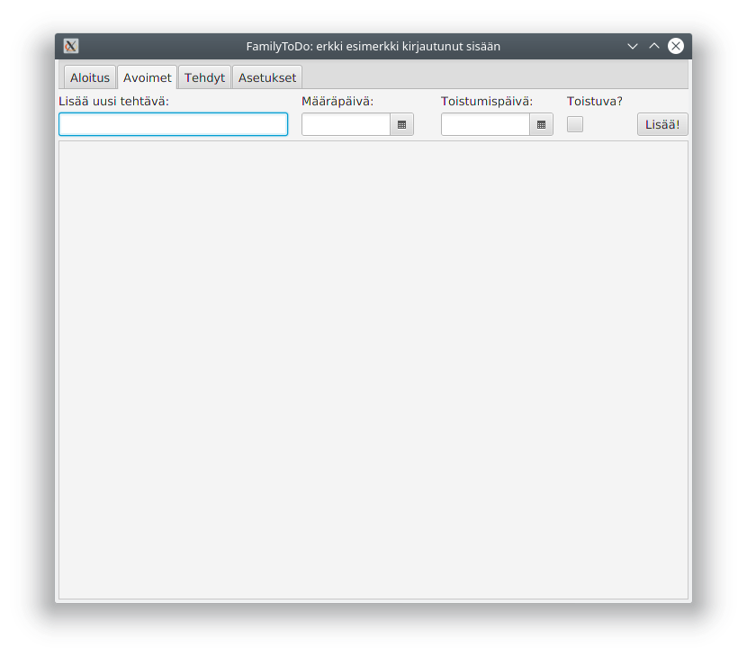
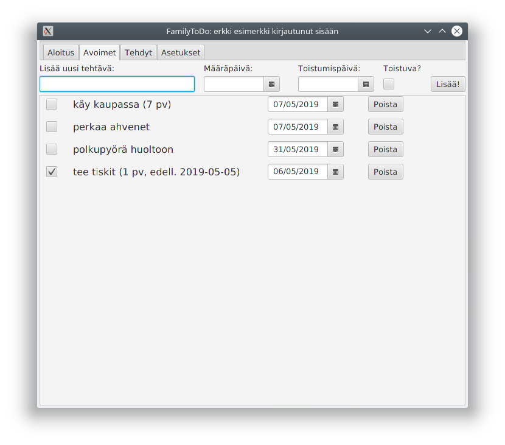

# Käyttöohje

## Käynnistäminen 
Sovellus käynnistetään releasesta tai generoitavasta jar-tiedostosta. Erillisiä asetustiedostoja ei tarvita. Jos sovellusta käytetään ensimmäisen kerran, niin se luo tarvittavat sqlite-tietokannat aloituksen yhteydessä.

## Kirjautuminen
Sovellus käynnistyy aloitusnäkymällä, josta pääsee kirjautumaan sisään käyttäen aiemmin luotuja tunnuksia ja salasanaa. Samalla sivulla on myös painike uuden käyttäjätunnuksen luontia varten.

Kun käyttäjä kirjatuuu onnistuneesti sisään, ohjelma siirtyy avoimien tehtävien näkymään. 

Jos käyttäjä ei kirjaudu sisään sovellukseen, niin sen toiminnot eivät ole käytettävissä vaan ohjelma näyttää pyynnön sisäänkirjautumisesta.

## Uuden käyttäjän luominen
Uusi käyttäjä luodaan oheisella näkymällä. Sovellus pyytää täyttämään kutsumanimen, käyttäjänimen sekä salasanan. Kutsumanimeä käytetään yläpalkissa sisäänkirjatumistilan näyttämiseen. Käyttäjänimen ja salasanan on oltava vähintään 3 merkkiä pitkiä ja käyttäjänimen on oltava uniikki. 

Kun käyttäjätunnus on luotu onnistuneesti, ohjelma ilmoittaa uuden luonnin onnistuneen ja pyytää siirtymään sisäänkirjautumissivulle painamalla painiketta.

## Tehtävien luominen ja päivittäminen

Jos aiempia avoimia tehtäviä ei ole niin näkymä on tyhjä. Uusia tehtäviä voi lisätä ylärivin lomakkeella. Uuden tehtävän minimivaatimus on tehtävän nimi, muut tiedot tulevat oletusasetuksista, jos jäävät tyhjäksi.

Jos käyttäjällä on aiempia tehtäviä edelliskerralta, niin ne näkyvät eräpäivien mukaan päivämäärä-järjestyksessä, lähimmät eräpäivät ylimpänä sekä tekemättömät ennen tehtyjä. Avoimien listalla näkyy tehdyistä vain samana päivänä suljetut tehtävät.

Toistuvia tehtäviä voi lisätä, joko ruksimalla 'Toistuva ?' -valinnan tai täyttämällä toistumispäivämäärän kalenterivalikosta. Toistuvan tehtävän nimen perässä lukee suluissa monenko päivän välein tehtävä uusiutuu sekä päivämäärä milloin tehtävä on viimeksi tehty. 

Tehtävät merkitään tehdyiksi ruksimalla rasti vasemman reunan radio-painikkeeseen. 

Tehdyt tehtävät näkyvät vielä samana päivänä myös avoimien tehtävien -listalla sekä tehtyjen tehtävien -listalla, mutta siirtyvät seuraavana päivänä kokonaan arkistoon.

Tehtävissä voi muokata päivämääriä kalenterien avulla. Jo tehtyjä tehtäviä voi palauttaa tekemättömiksi radio-painikkeella 

## Tehtävien arkisto
Kaikki tehdyt tehtävät näkyvät tehtyjen -listalla

## Tehtävien poistaminen 
Tarpeettomat tehtävät voi poistaa poista-painikkeella kaikilla näkymillä. Tehtävä poistuu pysyvästi.

## Asetuksien päivittäminen
Käyttäjä voi päivittää asetus-välilehdellä uusien tehtävien osalta kuinka monen päivän päähän tehtävän eräpäivä laitetaan (kun se jätetään avoimeksi) sekä mikä on toistuvien tehtävien oletustoistumis tiheys. Jos asetuksia ei ole muutettu, niin alkuperäinen määräpäivä on 2 päivää sekä toistumistiheys 1 viikko.

## Uloskirjautuminen
Käyttäjä voi kirjautua ulos aloitusvälilehdeltä, jolloin sovellus palautuu sisäänkirjautumissivulle ja muut välilehdet sulkeutuvat. Käyttäjä voi myös kirjatua ulos sulkemalla sovelluksen oikean yläkulman ruksista. 

