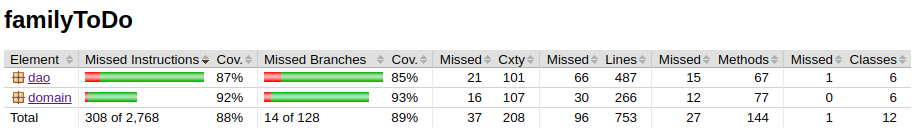

# Testausdokumentti

Ohjelmaa on kehitettäessä testattu manuaalisesti käyttämällä sekä JUnitin automaattisin testein. Automaattiset testit on luotu kaikille luokille sekä niiden yhteiskäytölle. 

## Yksikkö- ja integraatiotestaus

### logiikka 

Automaattiset testit testaavat pääasiassa familyTodo.domain -pakkauksen luokkia, keskittyen erityisesti TodoService-luokan toimintaan jäljittelemällä käyttötilanteita. Testit kuitenkin lähtivät liikkkeelle kunkin perusluokan, Todo, User ja UserPreferences, toiminnallisuuksista.

Integraatiotestit tehtiin käyttämällä valeluokkia, ja valtaosa testeistä onkin integraatiotestejä.

### DAO-luokat ja tietokannat

Tietokantojen luontia ja käyttöä sekä Dao-luokkien toimintaa on testattu hyödyntäen JUnitin tilapäiskansioita ja -tiedostoja. dao-pakkauksen testitiedostoissa katetaan kulmatapaukset, joita ei tullut vastaan sovelluslogiikan integraatiotesteissä.

### testikattavuus

dao ja domain -pakkausten kokonaiskattavuus on 88% metodeille ja 89% ehtolausekkeiden haarautumille. Pääosa testaamattajääneistä tapauksista on suoraviivaisia setteri- ja getteri -metodeja.

## Järjestelmätestaus

### Asennus

Järjestelmätestausta suoritettiin manuaalisesti ohjelmaa kehitettäessä sekä loppupalautuksen yhteydessä asentamalla ohjeiden mukainen jar-tiedosto. Ohjelma on testattu linux-ympäristössä.

Testit kattavat puhtaan pöydän testauksen sekä jatkotestauksen olemassa olevilla tiedostoilla.

### Toiminnallisuudet

Määrittelydokumetin toiminnallisuudet on käyty läpi ja ohjelma on yritetty syöttää kaikenlaisia virhearvoja. 

